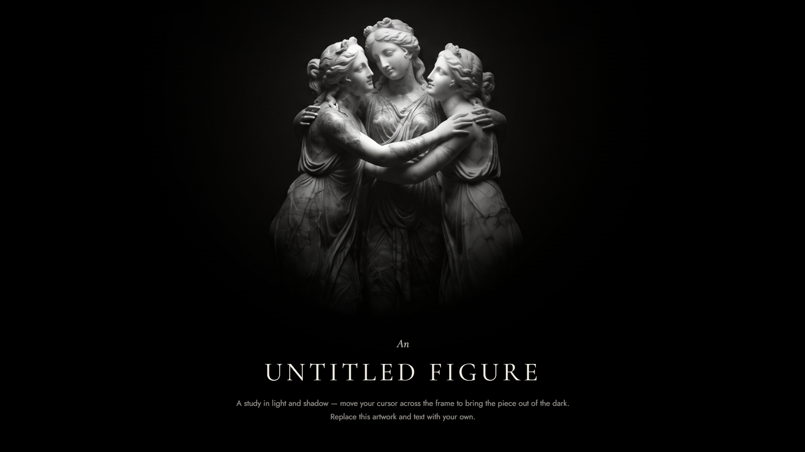

<div align="center">



</div>

---

<div align="center">

# ✦ OVERVIEW

**Spotlight Reveal** is an interactive visual experience built with pure HTML, CSS, and vanilla JavaScript.

A hidden artwork slowly emerges from darkness as the spotlight follows your cursor. Light, shadow, grain, glow, and subtle movement work together to create an atmospheric gallery-inspired composition.

Move your cursor across the frame to reveal the artwork and explore the interaction between **light and shadow**.

</div>

---

<div align="center">

# ✦ FEATURES

<table>

<tr>

<td align="center" width="33%">

### ◉

**SPOTLIGHT REVEAL**

A dynamic spotlight follows the cursor, revealing the artwork beneath the dark layer.

</td>

<td align="center" width="33%">

### ◉

**LIGHT & SHADOW**

Bright and dark artwork layers combine to create a cinematic reveal effect.

</td>

<td align="center" width="33%">

### ◉

**SMOOTH MOTION**

Cursor movement is interpolated with `requestAnimationFrame` for a fluid and natural response.

</td>

</tr>

<tr>

<td align="center" width="33%">

### ◉

**ATMOSPHERIC GLOW**

A soft radial glow follows the spotlight and adds depth to the composition.

</td>

<td align="center" width="33%">

### ◉

**FILM GRAIN**

Animated grain texture adds a subtle analog and editorial feel to the artwork.

</td>

<td align="center" width="33%">

### ◉

**RESPONSIVE**

The experience adapts to different screen sizes with responsive navigation and typography.

</td>

</tr>

</table>

</div>

---

<div align="center">

# ⚡ TECH STACK


`NO FRAMEWORKS` · `NO DEPENDENCIES` · `PURE VANILLA`

</div>

---

<div align="center">

# 🎨 CUSTOMIZATION

The artwork and text can be replaced with your own content.

### ◉ ARTWORK

Replace `foto.jpg` with your own image inside the project folder.

Both the bright and dark layers use the same artwork to create the reveal effect.

### ◉ TITLE & TEXT

Edit the content inside `.caption` to create your own artwork title, description, or gallery information.

### ◉ COLORS

Adjust the CSS variables inside `:root` to customize the paper tone, background, spotlight radius, and glow intensity.

```css
:root{
  --r-core: 90px;
  --r-edge: 360px;
  --glow-strength: 1;
  --paper: #f3efe6;
  --ink: #0a0a0a;
}
```

</div>

---

<div align="center">

# 🚀 GETTING STARTED

Download the ZIP or clone the repository, extract it, place your artwork inside the project folder, then open `index.html` in your browser.

No build step, no installation, and no dependencies required.

<table>

<tr>

<td align="center" width="33%">

### 1 · DOWNLOAD

Download the ZIP or clone the repository.

</td>

<td align="center" width="33%">

### 2 · REPLACE

Replace `foto.jpg` with your own artwork.

</td>

<td align="center" width="33%">

### 3 · OPEN

Open `index.html` in your browser.

</td>

</tr>

</table>

</div>

---

<div align="center">

# 🖼️ HOW IT WORKS

The experience uses two versions of the same artwork:

**BRIGHT LAYER**

Displays the full artwork with enhanced brightness and contrast.

**DARK LAYER**

Places a heavily darkened version of the artwork above it and uses a radial CSS mask to reveal the brighter layer around the cursor.

The result is a moving spotlight that follows the user's interaction.

JavaScript continuously updates the spotlight position and smoothly interpolates movement using `requestAnimationFrame`.

</div>

---

<div align="center">

# 📄 LICENSE

**Free to use and customize for your own projects.**

Please do not resell or redistribute the original template as your own.

</div>

---

<div align="center">

# 📦 PART OF THE LICODE SERIES

This project is part of an ongoing series of front-end experiments exploring **design**, **code**, **interaction**, and **motion**.

<a href="https://github.com/licode-cmd">


</a>

<a href="https://www.youtube.com/@licodee">


</a>

<a href="https://www.tiktok.com/@nihcode">


</a>

</div>
